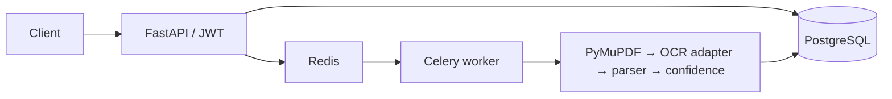

# Architecture

```mermaid
flowchart LR
  Client-->API[FastAPI / JWT]
  API-->DB[(PostgreSQL)]
  API-->Redis
  Redis-->Worker[Celery worker]
  Worker-->Pipeline[PyMuPDF → OCR adapter → parser → confidence]
  Pipeline-->DB
```

The system is a modular monolith: API, models, processing services and worker share versioned contracts while scaling API/worker replicas independently.
